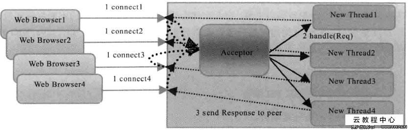
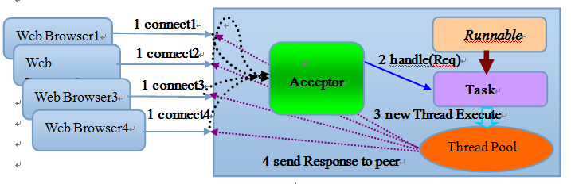

## 传统的BIO编程
   
* 网络编程的基本模型是client/server 模型《两个进程之间的相互通信） 服务端提供位置信息/绑定ip地址和监听端口）客户端通过连接操作向服务器监听的地址发送连接请求，通过三次握手建立通信，如连接成功 则通过网络套接字/socket/通信

* 基于传统同步阻塞模型开发中，serverSocket 负责绑定ip 地址，启动监听端口，socket 负责发起连接操作。连接成功之后，双方通过输入输出流进行同步阻塞式通信
   
   
### BIO通信模型图
  

* 采用BIO 通信模型的服务端，通常由一个独立的Acceptor 线程负责监听客户端的连接，它接收到客户端连接请求之后为每个客户端创建一个新的线程进行链路处理，处理完成后，通过输出流返回应答给客户段，线程销毁。

* 该模型缺乏弹性伸缩能力，当客户端并发并访问量增加，服务端的线程个数和客户端访问呈1：1 相关，由于线程是Java虚拟机的宝贵资源，当线程数膨胀后，系统的性能将急剧下降，随着并发访问增大，系统会发生堆栈溢出 创建新线程失败，最终导致进程宕机或者僵死，不能对外提供服务

###  同步阻塞式IO创建的TimeServer源码分析

###  同步阻塞式IO创建的TimeClient源码分析
>>1、BIO 的主要问题在于每当有一个新的客户端请求接入时，服务端必须创建一个新的线程处理新接入的客户端链路，一个线程只能处理一个客户端连接，在高性能服务器应用领域，需要面对上万个客户端的并发连接，无法满足高性能高并发接入的场景

>>2、为了改进一线程一连接模型，通过线程池或者消息队列实现，一个或者多个线程处理n个客户端的模型，由于它的底层通信机制依然使用同步阻塞IO，所以被称为伪异步，

## 伪异步IO编程
	后端通过一个线程池来处理多个客户端的请求接入，客户端个数M 线程池最大线程数N，通过线程池灵活调配线程资源，设置线程的最大值，防止并发接入导致线程耗尽，

###  伪异步IO模型图
  
* 当有新的客户端接入的时候，将客户端的Socket封装成一个Task（该任务实现java.lang.Runnable接口）投递到后端的线程池中进行处理,JDK的线程池维护一个消息队列和N个活跃线程对消息队列中的任务进行处理。由于线程池可以设置消息队列的大小和最大线程数，因此，它的资源占用是可控的，无论多少个客户端并发访问，都不会导致资源的耗尽和宕机。 

###   伪异步式IO创建的TimeServer源码分析

* 伪异步IO通信框架采用了线程池实现，因此避免了为每个请求都创建一个独立线程造成的线程资源耗尽问题。但是由于它底层的通信依然采用同步阻塞模型，因此无法从根本上解决问题。
###  伪异步IO弊端分析

## NIO编程
* NIO提供SocketChannel和 ServerSocketChannel不同的套接字通道实现;
通常 低负载 低并发的应用选择同步阻塞IO降低复杂度  高并发 高负载选择NIO 的非阻塞式模式

###  NIO类库简介
	
	1缓冲区buffer
	2通道channel
	3多复用selector
###  NIO服务端序列图
  

###  NIO创建的TimeServer源码分析

### NIO客户端序列图
 

	NIO的优点
	
	1. 不需要使用read()或者write()操作就可以处理文件内容了

	2. 修改文件后，修改自动flush到文件

	3. nio方式能很快处理大文件和处理效率很快
### NIO创建的TimeClient源码分析

## AIO编程
### AIO 创建的TimeServer源码分析

### AIO创建的TimeClient源码分析
### AIO版本时间服务器运行结果
##  4种IO的对比
### 概念澄清
### 不同IO模型对比
## 选择Netty的理由
### 不选择JAVA原生NIO编程的原因
	1 NIO的库和API繁杂，使用麻烦，需要熟练掌握Selector。ServerSocketChannel SocketChannel ByteBuffer等
	2 需要具备其他额外技能铺垫，如熟悉java 多线程编程。 这是应为NIO编程涉及reactor模式
	3 可靠性差 工作量和难度大。如客户端面临断连重连 网络闪断 半包读写 失败缓存 网络拥塞 和异常码流的处理问题
	4 jdk NIO 的bug epoll bug 导致selector 空轮询，最终导致cpu 100%
### 为什么选择Netty
	netty 是业界最流行的NIO 框架之一，它的健壮性 功能 性能 可定制性和可扩展性在同类框架中都是首屈一指的
	netty优点：
	
	api简单 开发门槛低
	功能强大 预置了多种编解码功能，支持多种主流协议
	定制能力强，可以通过channelHandler对通信框架进行灵活扩展
	性能高，通过与其他业界主流的NIO 框架对比 ，netty 的综合性能最优
	成熟 稳定，netty修复了已经发现的所有jdk NIO bug ，业务人员不需要在为NIO 的bug 而烦恼
	社区活跃，版本迭代周期短，发现的bug 可以被及时修复，更多的新功能也会加入
	经历了大规模的商业应用的检验，质量得到验证，netty 在互联网 大数据 网络游戏 企业应用 电信软件等众多行业中得到成功商用
## 总结
	IO的编程和使用差异，对比各自的缺点，给出使用建议对netty进行分析和总结

