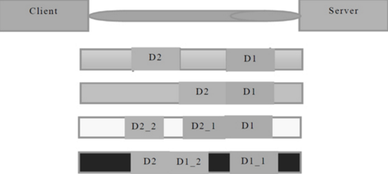
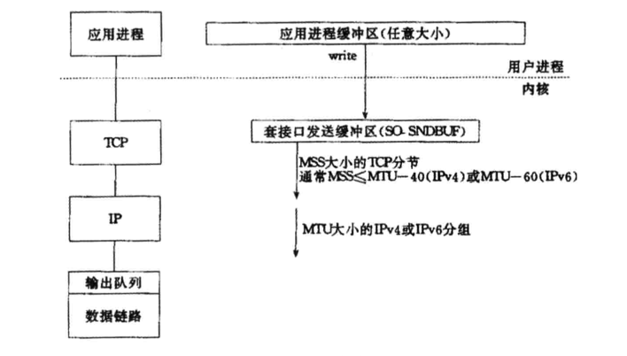

## TCP粘包/拆包
  
  服务器和客户端，当读取和发送消息时，考虑TCP 底层的粘包/拆包 ，
  
### TCP粘包/拆包问题说明
 

假设客户端分别发送了两个数据包D1和D2给服务端，由于服务端一次读取到的字节数是不确定的，故可能存在以下4种情况
（1）服务端分两次读取到了两个独立的数据包，分别是D1和D2，没有粘包和拆包；

（2）服务端一次接收到了两个数据包，D1和D2粘合在一起，被称为TCP粘包；

（3）服务端分两次读取到了两个数据包，第一次读取到了完整的D1包和D2包的部分内容，第二次读取到了D2包的剩余内容，这被称为TCP拆包；

（4）服务端分两次读取到了两个数据包，第一次读取到了D1包的部分内容D1_1，第二次读取到了D1包的剩余内容D1_2和D2包的整包。

如果此时服务端TCP接收滑窗非常小，而数据包D1和D2比较大，很有可能会发生第五种可能，即服务端分多次才能将D1和D2包接收完全，期间发生多次拆包
### TCP粘包/拆包发生的原因
	（1）应用程序write写入的字节大小大于套接口发送缓冲区大小；

	（2）进行MSS大小的TCP分段；

	（3）以太网帧的payload大于MTU进行IP分片。
 
### 粘包问题的解决策略
由于底层的TCP无法理解上层的业务数据，所以在底层是无法保证数据包不被拆分和重组的，这个问题只能通过上层的应用协议栈设计来解决，根据业界的主流协议的解决方案，可以归纳如下。

（1）消息定长，例如每个报文的大小为固定长度200字节，如果不够，空位补空格；

（2）在包尾增加回车换行符进行分割，例如FTP协议；

（3）将消息分为消息头和消息体，消息头中包含表示消息总长度（或者消息体长度）的字段，通常设计思路为消息头的第一个字段使用int32来表示消息的总长度；

（4）更复杂的应用层协议。
## 未考虑TCP粘包导致功能异常的案例

### TimeServer的改造

### TimeClient的改造

### 运行结果

##  利用LineBasedFrameDecoder解决TCP粘包问题

### 支持TCP粘包的TimeServer

### 支持TCP粘包的TimeClient

### 运行支持TCP粘包的时间服务器程序

### LineBasedFrameDecoder和StringDecoder的原理分析

## 总结

	本章对TCP 的粘包/拆包进行详解，给出解决问题的通用方法， 即用lineBasedFrameDecder+StringDecder 解决TCP粘包/拆包
