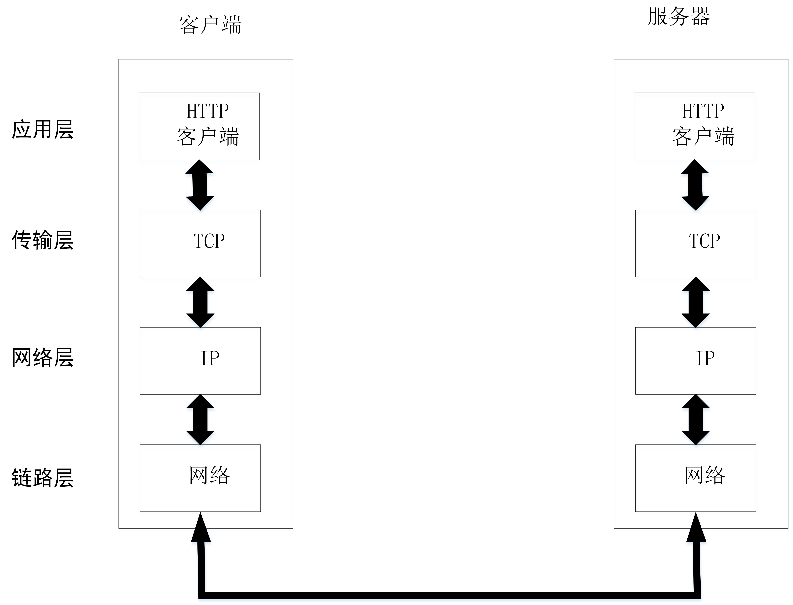
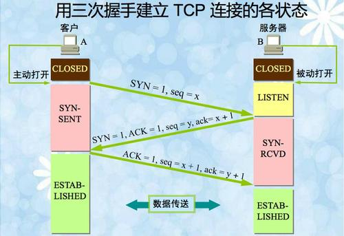
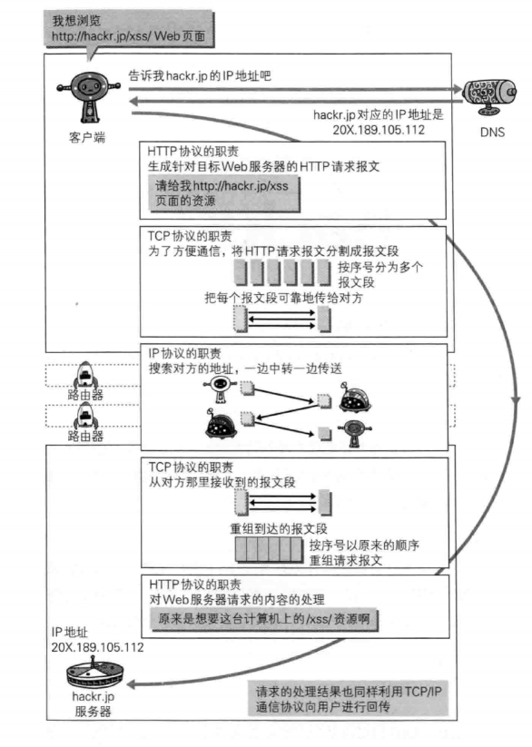

# 第一章 了解Web及网络基础
* 讲述了Web 是建立在何种技术之上，以及HTTP协议是如何诞生并发展的。

## 1.1 使用HTTP协议访问Web

## 1.2 HTTP的诞生

### 1.2.1 为知识共享而规划Web

### 1.2.2 Web成长时代

### 1.2.3 驻足不前的HTTP

## 1.3 网络基础TCP/IP

### 1.3.1 TCP/IP协议族

### 1.3.2 TCP/IP的分层管理

* TCP/IP协议族 按层次分为 应用层，传输层，网络层，数据链路层

* TCP/IP协议族各层的作用

>>     应用层
>>     应用层决定了向用户提供应用服务时通信的活动
>>     TCP/IP协议族内预存乐各类通用的应用服务.比如,FTP(File Transfer Protocol,文件传输协议)和DNS(Domain Name System,域名系统)
>>     HTTP协议也处于该层.

>>     传输层
>>     传输层对上层应用层,提供处于网络连接中的两台计算机之间的数据传输.
>>     在传输层有两个性质不同的协议:TCP(Transmission Control Protocol,传输控制协议)和UDP(User Data Protocol,用户数据报协议)
    
>>     网络层
>>     网络层用来处理在网络上流动的数据包.数据包上市网络传输的最小数据单位.该层规定了通过怎样的路径到达对方计算机,并把数据包传送给对方.
>>    与对方计算机之间通过多台计算机或网络设备进行传输时,网络层所起的作用就是在众多的选项内选择一条传输路线.
    
>>     数据链路层
>>    用来处理网络连接的硬件部分.包括控制操作系统,硬件的设备驱动,NIC(Network Interface Card,网络适配器,即网卡),及
>>    光纤等物理可见部分(还包括连接器等一切传输媒介).硬件上的范畴均在链路层的作用范围之内.

### 1.3.3 TCP/IP通信传输流

## 1.4 与HTTP 关系密切的协议：IP TCP DNS
### 1.4.1 负责传输的IP协议
* 使用ARP协议凭借MAC地址进行通信
* ARP(Address Resolution Protocol)地址解析协议，根据通信方的IP地址反查对应的MAC地址。

### 1.4.2 确保可靠性的TCP协议
* TCP位于传输层，提供可靠的字节流服务。
* 字节流服务（Byte Stream Service）是为了方便传输将大块数据分割成以报文段（segment）为单位的数据包进行管理。而可靠的传输服务指
能将数据准确的传给对方。

## 1.5 负责域名解析的DNS服务
* 提供域名到IP的解析服务
## 1.6 各种协议与HTTP协议的关系

## 1.7 URI和URL
* URI(Uniform Resource Identifier): 统一资源标识符
* URL(Uniform Resource Locator)：统一资源定位符

