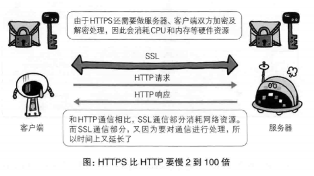

# 第七章 确保安全的HTTPS
## 7.1 HTTP的缺点
>>通信使用明文，内容可能会被窃听
>>
>>不验证通信方的身份，因此有可能遭遇伪装
>>
>>无法验证报文的完整性，所以有可能已遭篡改
>>
>>...... 
### 7.1.1 通信使用明文有可能会被窃听

TCP/IP是可能被窃听的网络

#### 加密处理防止被窃听
>>通信的加密
>
>>通过SSL(Secure Socket Layer,安全套接层)或TLS(Transport Layer Security,安全层传输协议)
的组合使用，加密HTTP的通信内容
>
>>内容的加密
>对协议的传输内容进行加密
### 7.1.2 不验证通信方的身份就可能遭遇伪装
#### 任何人都可以发起请求

#### 查明对手的证书

### 7.1.3 无法验证报文的完整性，可能已遭篡改
#### 接收到的报文可能有误

#### 如何防止篡改
## 7.2 HTTP+加密+认证+完整性保护=HTTPS
### 7.2.1 HTTP加上加密处理和认证以及完整性保护即是HTTPS

### 7.2.2 HTTPS是身披SSL外壳的HTTP
### 7.2.3 相互交换密钥的公开密钥加密技术
* 算法公开 密钥保密
#### 共享加密的困境
* 加密和解密密钥相同

#### 使用两把密钥的公开密钥加密
* 公开密钥加密使用一把非对称的密钥。一把私有密钥(private key),另一把公开密钥(public key).公钥加密，私钥解密的方式。

#### HTTPS采用混合加密机制
* HTTPS 采用共享密钥加密和公开密钥加密两者并用的混合加密机制。

### 7.2.4证明公开密钥正确性的证书

#### 可证明组织真实性的EV SSL证书
#### 用以确认客户端的客户端证书
### 7.2.5 HTTPS的安全通信机制

