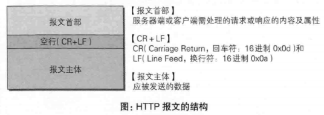
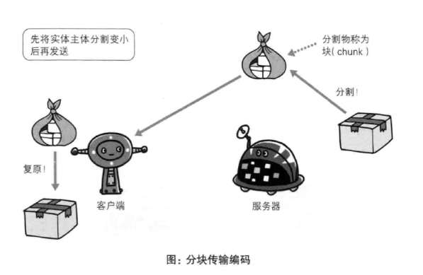

# 第三章 HTTP报文内的HTTP信息
* HTTP通信过程包括从客户端发往服务器端的请求及从服务器端返回客户端的响应。

## 3.1 HTTP报文

## 3.2 请求报文及响应报文的结构

## 3.3 编码提升传输速率

### 3.3.1 报文主体和实体主体的差异
* 报文(message)
    
    是HTTP通信中的基本单位，由8位字节流组成，通过HTTP通信传输。
* 实体(entity)

    作为请求或响应的有效载荷数据(补充项)被传输，其内容由实体首部和实体主体组成。
### 3.3.2 压缩传输的内容编码
### 3.3.3 分割发送的分块传输编码

## 3.4发送多种数据的多部分对象集合
## 3.5 获取部分内容的范围请求
## 3.6 内容协商返回最合适的内容

