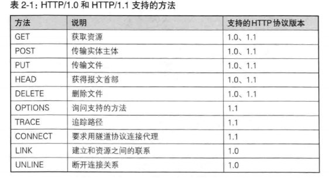
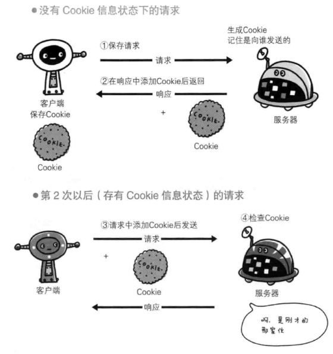

# 第二章 简单的HTTP协议
* HTTP协议结构讲解。

## 2.1 HTTP协议用户客户端和服务端之间的通信
## 2.2 通过请求和响应的交换达成通信
## HTTP 是不保存状态的协议
* HTTP是无状态的协议，自身不对请求和响应之间的通信状态进行保存。
* 使用HTTP协议，每当有新的请求时，就会有对应的响应产生。协议本省并不保存之前的一切请求或响应报文信息。
这是为了更快的处理大量事务，确保协议的可伸缩性。
## 2.4 请求URI定位资源
## 2.5 告知服务器意图的HTTP方法
>> GET: 获取资源
>> POST: 传输实体主体
>> PUT: 传输文件
>> HEAD: 获得报文首部
>> DELETE: 删除文件
>> OPTIONS: 询问支持的方法
>> TRACE: 追踪路径
>> CONNECT: 要求用隧道协议连接代理
## 2.6 使用方法下达命令

## 2.7 持久连接节省通信量
### 2.7.1 持久连接
* 持久连接(HTTP keep-alive) 只要任意一端没有明确提出断开连接，则保持TCP连接状态。

* 优点在与减少了TCP连接的重复建立和断开所造成的额外开销，减轻了服务器端的负载。另外，减少开销的
那部分时间，使HTTP请求和响应能更早的结束，这样Web页面的显示速度也就响应的提高了。
### 2.7.2 管线化
* 持久连接使多数请求以管线化(pipelining)方式发送成为可能。从前发送请求后需等待并收到响应，才能发送下一个请求。
管线化技术出现后，使并行发送多个请求成为可能。
## 2.8 使用Cookie的状态管理

