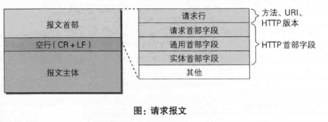
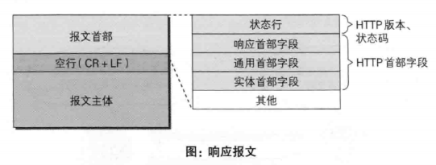

# 第六章 HTTP首部

## 6.1 报文首部
>> HTTP请求报文
>


以https://www.baidu.com/sugrec?prod=pc_his&from=pc_web&json=1&sid=1438_33059_32970_33098_33100_33211_26350_33198_33238&hisdata=&_t=1607676176162&sc=eb&csor=0 为例
``` 
		GET /sugrec?prod=pc_his&from=pc_web&json=1&sid=1438_33059_32970_33098_33100_33211_26350_33198_33238&hisdata=&_t=1607676176162&sc=eb&csor=0 HTTP/1.1
    Host	www.baidu.com
    Connection	keep-alive
    Accept	application/json, text/javascript, */*; q=0.01
    User-Agent	Mozilla/5.0 (Windows NT 10.0; Win64; x64) AppleWebKit/537.36 (KHTML, like Gecko) Chrome/86.0.4240.198 Safari/537.36
    Sec-Fetch-Site	same-origin
    Sec-Fetch-Mode	cors
    Sec-Fetch-Dest	empty
    Referer	https://www.baidu.com/
    Accept-Encoding	gzip, deflate, br
    Accept-Language	zh-CN,zh;q=0.9
    Cookie	BIDUPSID=05E796E4B36C79C4A5A2FB4C70034B63; PSTM=1604456316; BAIDUID=05E796E4B36C79C46AD544159F2D318D:FG=1; BD_UPN=12314753; BDORZ=B490B5EBF6F3CD402E515D22BCDA1598; H_WISE_SIDS=153899_159669_163071_161285_163320_160247_156289_159610_162915_160938_163304_162372_159382_162046_161422_162178_160879_163232_163396_161420_127969_161774_161563_160764_161731_155319_131423_162079_163522_162117_107312_162168_161965_163848_163271_144966_163153_162187_154214_158640_155529_159794_163118_147552_162478_162525_162817_162815_162642_159092_162264_162261_162156_110085_162025_163321_163568_163566; BDSFRCVID=EL-OJexroG3SCsorFuI_bczBFOivcXjTDYLEOwXPsp3LGJLVNZYsEG0PtOGUc_K-oxmyogKK0gOTH6KF_2uxOjjg8UtVJeC6EG0Ptf8g0M5; H_BDCLCKID_SF=tRk8oK-aJKvDqTrP-trf5DCShUFsXtJtB2Q-XPoO3KO6EPOvKxjhyjLV-p6G0fR0bD7vBfbgylRp8P3y0bb2DUA1y4vpWqTk-2TxoUJ2Bh3lHU7oqtnWhJFebPRiJPb9Qg-qahQ7tt5W8ncFbT7l5hKpbt-q0x-jLTnhVn0MBCK0hD0wDT8hjTPVKgTa54cbb4o2WbCQKRnU8pcN2b5oQTt9Lpbybf5tWmJa3-cP3q7EfROyMlOUWfAkXpJvQnJjt2JxaqRCBfcZqp5jDh3MXU-A-nnie4ROa65y0hvctn3cShPCyUjrDRLbXU6BK5vPbNcZ0l8K3l02V-bIe-t2XjQhDHt8J50tJb3aQ5rtKRTffjrnhPF3bx-rXP6-hnjy3b7g5-OO-qQhOf3P-n6IQx4t5xbvaq3RymJ42-39LPO2hpRjyxv4XlI4KPoxJpOJB2vP3M7cHR7WDtTvbURvD--g3-AqBM5dtjTO2bc_5KnlfMQ_bf--QfbQ0hOhqP-jBRIEoC0XtK-hMIvPKITD-tFO5eT22-usMITd2hcHMPoosIObLnboKxK0yqQa5bTG3eO0LJO92fbUoqRHXnJi0btQDPvxBf7pBHQkQh5TtUJM8p3a-pnvqt4bhqryKMnitIv9-pPKWhQrh459XP68bTkA5bjZKxtq3mkjbPbDfn028DKuDjtBDT30jNRabK6aKC5bL6rJabC3sq4zXU6q2bDeQNbg3bJy-ectax7tK-cIsl7Y54biMl0vWtv4WbbvLT7johRTWqR48xcXKUonDh83XPJP5hRiHCOOW4TO5hvvhb3O3MA-yUKmDloOW-TB5bbPLUQF5l8-sq0x0bOte-bQXH_E5bj2qRAO_DjP; BDUSS=htOEdjS0Z0Y3JEYUxDYktkZjltLWo3ZGtTdGtVei1FMU85Y1psRkt2NlZZZnBmSVFBQUFBJCQAAAAAAAAAAAEAAADQUkIqaGVhcnTLrrquAAAAAAAAAAAAAAAAAAAAAAAAAAAAAAAAAAAAAAAAAAAAAAAAAAAAAAAAAAAAAAAAAAAAAAAAAJXU0l-V1NJfWk; BDUSS_BFESS=htOEdjS0Z0Y3JEYUxDYktkZjltLWo3ZGtTdGtVei1FMU85Y1psRkt2NlZZZnBmSVFBQUFBJCQAAAAAAAAAAAEAAADQUkIqaGVhcnTLrrquAAAAAAAAAAAAAAAAAAAAAAAAAAAAAAAAAAAAAAAAAAAAAAAAAAAAAAAAAAAAAAAAAAAAAAAAAJXU0l-V1NJfWk; ab_sr=1.0.0_NTdiMGFhODYwNDZjNmJmNmY0ZDc4YTA0ZGZhYzJkNGFjMmFmOWQ1MWZjZTJiOTdhYTI1NmZmMTdjZDJhNjk4ZTBmZGY0NTk4ZGMxYjhkYThmNWFjOGE2ZWU2NDExOGYw; delPer=0; PSINO=5; BAIDUID_BFESS=8A9087B7AD25775ADB8ACE7EBF6379DF:FG=1; BD_HOME=1; COOKIE_SESSION=127_0_9_9_6_20_0_0_9_4_0_4_4_0_0_0_1607672163_0_1607672324%7C9%23247952_20_1607577522%7C9; BD_CK_SAM=1; H_PS_645EC=f936T%2BEirF0pFo0nesVjW7q6s%2FS5GUWdOEKsH8K%2B%2FKcfUVk1s50o501I7Yg; H_PS_PSSID=1438_33059_32970_33098_33100_33211_26350_33198_33238; sug=3; sugstore=1; ORIGIN=2; bdime=0; BA_HECTOR=250kah2g01a58g2khc1ft6c7n0q
	
```


>> HTTP响应报文
>

``` 
		HTTP/1.1 200 OK
    Content-Length	53
    Content-Type	text/plain; charset=UTF-8
    Date	Fri, 11 Dec 2020 08:42:57 GMT
    Connection	keep-alive
    	
```
## 6.2 首部字段
### 6.2.1 HTTP首部字段传递重要消息
### 6.2.2 HTTP首部字段结构
``` 
	首部字段名: 字段值
```
### 6.2.3 4种HTTP首部字段类型
* 通用首部字段(General Header Fields)
 请求报文和响应报文都会使用的首部。
* 请求首部字段(Request Header Fields)
 客户端发起请求时使用的首部
* 响应首部字段(Response Header Fields)
 服务器向客户端返回响应时使用的首部
* 实体首部字段(Entity Header Fields)
 
 


